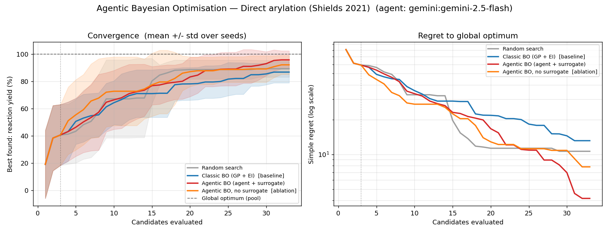

# Agentic Bayesian optimisation — does an LLM help the BO loop?

A compact, reproducible study of an **agentic Bayesian-optimisation (BO) loop**: an LLM
agent that decides which experiment to run next, benchmarked against classic BO across a
synthetic materials task and two **real reaction-optimisation datasets**. On the hard one it
reproduces a published LLM-BO result — see the [headline result](#headline-result--direct-arylation-hard-task-reasoning-bo-protocol).

Five policies compete on the same task, using as few (simulated) experiments as possible.
For a step-by-step, side-by-side walkthrough of *how each one decides* on one identical
scenario (with real numbers and a visual), see **[docs/AGENTIC_BO_METHODS.md](AGENTIC_BO_METHODS.md)**.

| Policy | What it does |
| --- | --- |
| **Random search** | Naive floor — pick the next candidate at random. |
| **Classic BO** *(baseline)* | Gaussian-process surrogate + Expected Improvement; batches via local penalization (a fair stand-in for qLogEI). |
| **Agentic BO** | An **agent** (Gemini / Claude, or a heuristic stand-in) chooses the next experiment from a surrogate-informed shortlist, reasoning about explore/exploit each round. |
| **Agentic BO – no surrogate** *(ablation)* | The same agent, but **without** the GP's mean/std/EI — isolates how much the surrogate contributes vs. the agent's own knowledge. |

The point is not a new method. It is an honest, small-scale answer to a practical question —
*does putting an LLM in the BO loop actually help, and when?* — with the evaluation hygiene
(fair baseline, ablation, multi-seed spread) needed to trust the answer.

## Terminology

* **Pool** — the finite list of candidate experiments (e.g. reaction conditions);
  the task is to find the best one in as few tries as possible.
* **Yield** — the measured outcome of one experiment; the number being maximised.
* **Surrogate (GP)** — a statistical model fit to the measurements so far; for
  every untried candidate it predicts a value and how uncertain that prediction is.
* **EI (Expected Improvement)** — a score combining prediction and uncertainty:
  how much a candidate can be expected to beat the current best. Classic BO
  measures the highest-EI candidate next.
* **Explore vs. exploit** — measure uncertain candidates to learn more, or
  promising ones to score now.
* **Round, batch size q** — each round proposes q candidates, which are then
  measured together.
* **IMP@k** — the quality of round k's proposals: the best yield in that
  round's batch.
* **Cold start** — the first rounds, when almost nothing is measured yet and the
  surrogate knows little.
* **Seed** — the random starting condition of a run; runs repeat over several
  seeds and results are means over them.

## Three datasets — increasing in how much an agent can help

**`mof`** *(synthetic, default)* — CO₂ working capacity of metal-organic frameworks as a
smooth function of five physical descriptors. Classic GP+EI is already near-optimal on a
landscape this smooth, so an agent has little to add. Useful as a sanity check and a floor.

**`buchwald`** *(real, easy)* — the Buchwald-Hartwig HTE dataset of Ahneman et al.
(*Science* 2018; often called the Dreher-Doyle dataset): a complete grid of **3,955**
Pd-catalysed C-N cross-couplings
(4 ligands × 3 bases × 22 additives × 15 aryl halides) with measured yields. Discrete and
built of **named building blocks** (XPhos, P2Et, …) — but good conditions are *dense*
(~7% of the pool yields ≥80%), so even random reaches ~85% of the optimum and every method
saturates. A useful "is the agent at least competitive?" check.

**`arylation`** *(real, hard)* — the Shields et al. direct C-H arylation dataset (*Nature*
2021): a full-factorial pool of **1,728** reactions (12 ligands × 4 bases × 4 solvents × 3
concentrations × 3 temperatures). Deceptive: **~32% of conditions give ~0% yield** and the
median is ~8%, so a GP starts blind and cold-start prior knowledge (avoid dead
ligand/base/solvent combinations) matters most. This is the regime where LLM-BO has been
reported to clearly beat classic BO — e.g. Ramos et al. and Reasoning-BO (see
[References](#references)).

Because both datasets are finite with known ground truth, the pool optimum is exact and
"% of optimum" needs no API to compute.

### Three things that make the comparison *fair*

Good reactions are dense enough that best-of-N saturates — even random reaches ~89% of the
optimum, so the *final* metric barely separates methods. A trustworthy comparison needs
three corrections:

- **IMP@k, not final.** With `--batch-size > 1` the summary reports **IMP@k** = the per-round
  *proposal quality* (best yield in round k's batch, non-cumulative), the metric Reasoning-BO
  (2025) uses. That is where cold-start prior knowledge shows up; the final saturates.
- **A fair batch baseline.** Classic BO batches via **local penalization** (spread picks out),
  not greedy top-q EI (near-duplicate picks that get stuck). The greedy batch costs classic BO
  six IMP@5 points (64.2 vs 70.0) and lets *random* beat it on the final metric — a baseline
  artifact that produced most of the agent's apparent mid-game lead.
- **Multiple seeds.** 10 seeds; the gaps sit inside ±7–13, so single-run "leads" are treated
  as noise until they survive the spread.

(`--per-substrate` is also available for Buchwald: fix the aryl halide and optimise the 264
ligand/base/additive combinations, averaged over substrates.)

## Quick start

Uses [uv](https://docs.astral.sh/uv/); no uv? `pip install -e ".[gemini]"` works too
(then drop the `uv run` prefix).

```bash
uv sync                             # offline runs; add --extra gemini for the LLM agent

# Fast, fully offline — heuristic agent stands in for the LLM (no API key):
uv run run_agentic_bo.py                       # synthetic MOF task
uv run scripts/get_data.py          # fetch the reaction datasets (~2 MB, once)
uv run run_agentic_bo.py --dataset buchwald    # real reaction task, heuristic baselines

# The real agentic loop on the reaction task, with Gemini:
export GEMINI_API_KEY=...
uv run run_agentic_bo.py --dataset buchwald --agent gemini --seeds 3 --budget 20 --verbose

# The fair "can the agent beat classic BO?" test — per-substrate + cold start:
uv run run_agentic_bo.py --dataset buchwald --per-substrate --substrates 4 \
              --n-init 3 --budget 12 --agent gemini --seeds 3 --verbose

# ...or with Claude (--extra claude, --agent claude, ANTHROPIC_API_KEY).

# Reproducing Reasoning-BO's Direct Arylation protocol (batch 3, IMP@k metric):
uv run run_agentic_bo.py --dataset arylation --agent gemini \
              --n-init 3 --budget 30 --batch-size 3 --seeds 10 --verbose
```

**Comparing to the literature.** With `--batch-size > 1` the summary reports **IMP@k**
(the per-round *proposal quality* — the best yield among round k's batch, non-cumulative),
matching the metric in Reasoning-BO (2025). As a validation, this repo's random search
reproduces their random baseline closely (IMP@1 ≈ 30 vs 29, including the non-monotonic
dip). Note the
final best-so-far converges high for every method (their Log-AUC column agrees) — the
signal lives in the early IMP@k, not the final. The agentic policy matches their
Reasoning-BO row at IMP@3 (67.0 vs 66.6) and IMP@5 (71.7 vs 71.2), though not at IMP@1
(41.9 vs 60.1 — round-one behaviour is not fully matched). Exact numeric parity is limited
by their under-specified search space (likely continuous concentration/temperature vs our
discrete 1728-grid) and their qLogEI vs the local-penalization batch here, so compare
*patterns*, not decimals. (The synthetic MOF objective, for its part, is physically
motivated but not real data.)

Outputs land in `results/`: `convergence_<dataset>_<agent>.png` and a `summary_*.json`.
Run the tests with `uv run pytest -q`.

## Headline result — direct arylation (hard task), Reasoning-BO protocol

Gemini 2.5 Flash agent, paper protocol (n_init 3, batch 3, 30 experiments, 10 seeds), with
`classic_bo` on a fair local-penalization batch. **IMP@k** = per-round proposal quality
(matches Reasoning-BO); `final` = best-so-far as % of the pool optimum:



| method | IMP@1 | IMP@3 | IMP@5 | final |
| --- | --- | --- | --- | --- |
| random | 30.4 | 25.3 | 48.7 | 89% |
| classic BO (GP + EI, LP batch) | 36.2 | 61.6 | 70.0 | 87% |
| **agentic BO** (Gemini + surrogate) | 41.9 | 67.0 | **71.7** | **96%** |
| agentic BO, no surrogate | **53.0** | 47.3 | 47.2 | 92% |
| *paper — Vanilla BO* | 43.6 | 45.2 | 55.9 | — |
| *paper — Reasoning-BO* | 60.1 | 66.6 | 71.2 | — |

Three readings:

- **Cold start (IMP@1) — real agent win.** Chemistry-only (no surrogate) scores 53 vs BO's 36:
  it picks good ligand/base/solvent conditions from round one, which a GP-from-scratch cannot.
- **Final — real agent win.** 96% vs 87%: classic BO over-exploits and caps out on this
  deceptive landscape (32% of conditions are dead); the agent escapes the trap.
- **Mid-trajectory (IMP@5) — a tie** against the *fair* baseline (71.7 vs 70.0). Against the
  weak greedy-EI batch the agent led by six points; that gap belonged to the baseline, not
  the agent.

On the **easy** `buchwald` task the opposite holds — the same agent, opposite conclusions
(Buchwald numbers from the per-substrate protocol, `--per-substrate`):

| | Buchwald (easy, saturated) | Arylation (hard, deceptive) |
| --- | --- | --- |
| agentic BO **with** surrogate | **hurts** (86% vs classic 93%) | **helps** (96% vs classic 87%) |
| agentic BO **without** surrogate | ties classic BO, low variance | best cold start (IMP@1) |

On a dense landscape greedy EI is already near-optimal, so letting the LLM overrule it only
adds noise; on a deceptive one the surrogate's EI signal and the agent's prior complement
each other. **Whether an LLM helps BO is dataset-dependent**; the informative benchmark is
the regime that matches the target problem.

## Credibility checks — is the agent's edge real?

Both datasets are public and plausibly in LLM training data, and the agent returns a
free-text rationale that could be confabulated. The repo ships three tools to attack its
own headline claim:

**Rationale audit** *(no API calls)* — every agentic run writes
`results/decisions_<tag>.jsonl`: per decision the full shortlist with ground truth next to
the agent's stated `strategy`/`rationale`. The audit checks the reasoning against reality —
do "exploit" rounds out-yield "explore" rounds, do picks match the stated strategy, and
when the agent overrules max-EI, does that pay off?

```bash
uv run scripts/audit_decisions.py results/decisions_arylation_gemini.jsonl --show 5
```

**Zero-shot leakage probe** — asks the model for its best pick with *zero measurements
shown*, over many seeded random shortlists, and scores the picks against the ground-truth
pool. Near the blind baseline = no usable prior; well above = prior knowledge (chemistry
*or* memorisation — the next two flags separate those):

```bash
uv run scripts/leakage_probe.py --dataset arylation --agent gemini --trials 20
uv run scripts/leakage_probe.py --dataset arylation --agent gemini --trials 20 --anonymize
```

**Name ablation & permuted yields** — two `run_agentic_bo.py` flags that rerun the benchmark under
counterfactual conditions:

- `--anonymize` withholds reagent names/SMILES (opaque ids only). If the cold-start edge
  disappears, it came from *named* chemistry knowledge — the claimed mechanism.
- `--permute-yields` shuffles the yields across candidates (seeded), so chemistry no longer
  maps to reward. The agent should fall to random; the decision log keeps both the observed
  and the original yields, and the audit's leakage indicator flags a model that keeps
  chasing the *original* optimum it was never shown (memorisation, not reasoning).

Outputs get their own tags (`..._anon_...`, `..._permuted_...`), so they never overwrite
the headline results.

**What they showed** (Gemini 2.5 Flash, arylation; zero-shot probe 40 trials, ablations on
the full 10-seed protocol):

- **Rationale audit:** the agent follows max-EI in 93% of decisions (80/86) — mostly
  rubber-stamping the acquisition function — but its six overrules gained **+9.9 yield
  points** on average. Stated strategies connect to behaviour (96% of "exploit" picks come
  from the shortlist's top-3 by predicted mean), and without the surrogate its top pick sits
  at the **79–82nd percentile** of a random shortlist by true yield, where a blind pick sits
  at the 50th.
- **Zero-shot probe** — one pick per seeded random shortlist, no measurements shown:

  | 40 trials | pool percentile | pick yield |
  | --- | --- | --- |
  | blind pick (baseline) | 54% | 19.4 |
  | Gemini, named reagents | **67%** | **32.3** |
  | Gemini, anonymised | 57% | 25.8 |

  A real but modest prior that largely disappears without reagent names — the zero-shot
  knowledge is accessed through the names.
- **Name ablation in the loop:** the cold-start edge *survives* anonymisation (no-surrogate
  IMP@1 53.0 → 49.4; classic BO sits at 36.2), so it is **few-shot combinatorial reasoning
  over the init observations, not named chemistry** — the logged rationales show it reusing
  components of the best initial observation and varying one factor at a time. Names do
  matter mid-game (no-surrogate IMP@3 drops 47.3 → 28.8).
- **Permuted yields:** with chemistry decoupled from reward, every edge collapses to
  random-or-worse (cold start 53.0 → 32.3; final 96% → 79%, *below* random's 87%), and the
  leakage indicator is clean: picks sit at the 56–60th percentile of the *original* yields
  (never shown) versus 79–82 when the yields are real. A model recalling the dataset would
  have kept chasing the original optimum — **no evidence the headline result is dataset
  recall**.

## Structured evals with Langfuse (optional)

The decision log is the source of truth; [Langfuse](https://langfuse.com) (MIT, self-hostable)
adds the structured layer on top: a trace UI to drill into any single decision, first-class
scores, and session-level A/B comparison across policies and seeds. The mapping is
**session = run tag, trace = policy × seed campaign, span = decision round**, with the
audit's own metrics attached as scores (`pick_percentile`, `follows_max_ei`,
`overrule_gain_y`, `batch_best_y`, `fallback`, `cache_hit`) — computed by the same code
(`agentic_bo/tracing.py:derived_scores`), so the UI and `audit_decisions.py` can never
disagree.

```bash
uv sync --extra eval
export LANGFUSE_PUBLIC_KEY=... LANGFUSE_SECRET_KEY=...
export LANGFUSE_HOST=http://localhost:3000    # self-hosted; omit for Langfuse cloud

# Live: trace a run as it happens (adds per-decision LLM latency):
uv run run_agentic_bo.py --dataset arylation --agent gemini --batch-size 3 --langfuse

# Backfill: push an existing decision log — cached runs included, zero API calls:
uv run scripts/push_to_langfuse.py results/decisions_arylation_gemini.jsonl
```

To self-host: `git clone https://github.com/langfuse/langfuse && cd langfuse &&
docker compose up`, then create a project at `http://localhost:3000` and copy its keys.
Tracing is off by default, needs no dependencies unless enabled, and fails soft — a
missing package, key, or server prints one warning and never touches the run.

## Making the agent *actually* agentic (tool use, memory, deliberation)

The `agentic_bo` policy above is honestly **LLM-guided BO**: one stateless call per round
that ranks ~8 pre-digested options while the harness does the real work. The `agentic_tools`
policy ([agentic.py](../src/agentic_bo/agentic.py)) is the genuinely-agentic version — each
round the model *drives* the loop through Gemini function-calling, in two phases that can
use **different models**:

- **Investigate** (worker model) — a tool loop over the real BO state: `predict` the
  surrogate on any candidates it names, `search_candidates` across the whole pool itself
  (by EI / mean / uncertainty / reagent match / random) instead of a fixed shortlist, and
  `recall` a scratchpad carried across rounds. Ends with `report`.
- **Deliberate** (reasoner model) — given the report, the measured history and its memory,
  optionally `predict` a few candidates to verify a hypothesis, then `submit` the batch with
  a `strategy`/`rationale` and a `note` appended to memory.

The research question this sets up: **does a stronger reasoner at the decision step (with a
cheap worker exploring) beat the single-call agent?** Route the two steps independently:

```bash
# Tool-agency alone (same model both phases) vs a stronger reasoner at the decision step:
uv run run_agentic_bo.py --dataset arylation --agent gemini --methods classic_bo agentic_bo agentic_tools \
              --worker-model gemini-2.5-flash --reasoner-model gemini-2.5-flash \
              --n-init 3 --budget 30 --batch-size 3 --seeds 10
uv run run_agentic_bo.py --dataset arylation --agent gemini --methods agentic_tools \
              --worker-model gemini-2.5-flash --reasoner-model gemini-2.5-pro \
              --n-init 3 --budget 30 --batch-size 3 --seeds 10
```

The batch size `q` and total budget stay **fixed** for a fair head-to-head with
`agentic_bo` (lesson 3 under [What this study taught](#what-this-study-taught)); the agent
may *state* a preferred batch size or a "stop now" — logged for analysis, not acted on.
Runs are tagged by routing (`..._tools_flash-flash_...`, `..._tools_flash-pro_...`) so
configs never overwrite each other. Offline,
`--agent heuristic` uses a deterministic tool agent (the CI path and knowledge-free floor).

**Does it help?** (arylation, 10 seeds; final-metric differences among the agentic variants
sit within the ±7–9 per-seed spread):

| method | IMP@1 | IMP@3 | IMP@5 | final |
| --- | --- | --- | --- | --- |
| agentic BO — single call (flash) | 41.9 | 66.9 | 71.4 | **95%** |
| agentic tools — flash + flash | 55.0 | 54.5 | **73.6** | 86% |
| **agentic tools — flash + Pro** | **57.8** | 66.7 | 68.5 | 90% |

Tool-agency buys a large, robust **cold-start** gain (IMP@1 42 → 55–58, beating even the
knowledge-only agent), and routing a **stronger reasoner to the decision step** (flash→Pro)
repairs the mid/late convergence that pure tool-agency softens. But it is *not* a uniform
win — the simple single call still converges best on the final metric. The honest read is a
hybrid: agentic tool loop for cold start, plain agent / classic BO for late convergence.

## What this study taught

1. **The metric decides the conclusion.** Under a tight budget on a forgiving pool, final
   best-so-far saturates — random search reaches ~89% of the optimum — so it barely
   separates methods. Early-round proposal quality (IMP@k) is where the differences live.
   Pick the metric that discriminates in the regime that matters, not the one that is
   easiest to compute.
2. **The dataset decides whether the agent helps.** The same agent *hurts* on the easy
   Buchwald pool (greedy EI is already near-optimal; the LLM adds noise) and *wins* on the
   deceptive arylation pool (prior knowledge avoids dead regions). "Does an LLM help BO?"
   has no dataset-independent answer.
3. **A win is only as trustworthy as the baseline.** Replacing a weak greedy top-q EI batch
   with local penalization lifted classic BO's IMP@5 from 64 to 70 and erased most of the
   agent's apparent mid-game lead. The symptom that exposed it: random was beating classic
   BO.
4. **Locate the advantage instead of just claiming it.** Against the fair baseline the
   agent's edge is concentrated at cold start and in escaping the deceptive landscape's
   trap; mid-trajectory it is a tie. "Where does the advantage live" is a more useful — and
   more credible — claim than "the agent wins."
5. **Hygiene is what makes the numbers believable.** Ten seeds with the spread reported
   (gaps sit inside ±7–13), fallback counting (an early bug had *every* LLM call silently
   falling back to EI — the "agentic" numbers were the fallback), and a persistent decision
   cache so re-analysis costs nothing.
6. **Audit the reasoning against ground truth.** The agent follows max-EI 93% of the time;
   its six overrules gained +9.9 yield points on average. The measurable value is a handful
   of decisive moments on top of routine surrogate work — which is also the honest
   description of what "agentic BO" is here: LLM-guided BO.
7. **Attack the headline claim before believing it.** The leakage probes (zero-shot, name
   ablation, permuted yields) not only cleared dataset recall — they *changed the
   mechanism*: the cold-start edge is few-shot combinatorial reasoning over the first
   observations, not named chemistry knowledge. The counterfactual runs replaced a
   plausible story with a better-supported one.
8. **"More agentic" is not uniformly better.** Tool use + memory buys a decisive cold-start
   gain, but the plain single-call agent still converges best on the final metric; routing
   a stronger model to only the decision step is a real lever. Agency sharpened the edge
   that was already real rather than winning everywhere.

## Open threads

Fairness upgrades, in the spirit of lesson 3 — attack the remaining ways the comparison
could still be unfair:

- **A BoTorch qLogEI baseline**, to remove any remaining doubt about batch fairness.
- **Batch diversity for the agent.** Classic BO's batch spreads its picks by construction
  (local penalization); the agent returns its q picks in one shot with no such mechanism.
  Giving it the same machinery — fantasise the GP update or penalise the shortlist between
  picks — would make a win attributable to reasoning rather than batch construction.
- **A stronger surrogate, not a stronger agent.** One-hot encodings contain zero chemistry —
  every ligand is equidistant from every other, so the GP cannot generalise across reagents
  early on. Both datasets ship DFT descriptors (quantum-chemistry-computed properties per
  reagent, so similar reagents get similar features). If classic BO on those closes the
  cold-start gap, part of the agent's edge was weak featurization rather than reasoning.

Extensions:

- **A hybrid policy** — the agentic loop for the first rounds, classic BO mid-game, the
  agent again if progress stalls. The tool-agent results make the case concrete (decisively
  best at cold start, softer late); it remains to be built and measured as an explicit
  fifth method.
- **A genuinely continuous / higher-dimensional space**, where a GP-from-scratch is weakest
  and the prior should matter most — the regime the cold-start result already hints at.
- **Cost accounting.** API cost and wall-clock next to the yield numbers; "+9pp final for
  cents of API calls" is the decision-relevant form of the result.
- **Acting on loop control, and cross-provider routing.** The tool agent's preferred batch
  size and stop signal are logged but held fixed for fair IMP@k, and worker/reasoner
  routing is Gemini-only today.

## How the agentic loop works

Each round the agentic policy:

1. Fits the GP surrogate on everything measured so far.
2. Builds a **shortlist** — mostly top-Expected-Improvement candidates plus a couple of
   high-uncertainty ones, so exploration is always an option.
3. Hands the agent the run history + each candidate (as chemistry, with a reagent legend)
   and, when available, the surrogate's mean ± std and EI.
4. The LLM returns a **structured decision** (`picks`, `strategy`, `rationale`) via
   the provider's JSON-schema / structured-output mode; the measured value is fed back and
   the loop repeats.

Agent backends are pluggable (`src/agentic_bo/agent.py`), all behind one `select_batch`
interface: `HeuristicAgent` (deterministic, runs anywhere), `GeminiAgent` (`google-genai`,
default `gemini-2.5-flash`), `AnthropicAgent` (`anthropic`, default `claude-opus-4-8`).
Set `--model` to override; each round the agent returns a ranked batch of `--batch-size` picks.


## References

Datasets (downloaded by `scripts/get_data.py`, not redistributed here):

- Ahneman, D. T., Estrada, J. G., Wang, S., Dreher, S. D. & Doyle, A. G.
  *Predicting reaction performance in C-N cross-coupling using machine learning.*
  Science 360, 186-190 (2018). [doi:10.1126/science.aar5169](https://doi.org/10.1126/science.aar5169).
  File obtained from [rxn4chemistry/rxn_yields](https://github.com/rxn4chemistry/rxn_yields) (MIT).
- Shields, B. J. et al. *Bayesian reaction optimization as a tool for chemical synthesis.*
  Nature 590, 89-96 (2021). [doi:10.1038/s41586-021-03213-y](https://doi.org/10.1038/s41586-021-03213-y).
  Files obtained from [b-shields/edbo](https://github.com/b-shields/edbo) (MIT).

Methods compared against / built on:

- *Reasoning BO: Enhancing Bayesian Optimization with Long-Context Reasoning Power of LLMs.*
  [arXiv:2505.12833](https://arxiv.org/abs/2505.12833) (2025) — the IMP@k metric and the
  direct-arylation protocol reproduced here.
- Ramos, M. C. et al. *Bayesian Optimization of Catalysis with In-Context Learning.*
  ACS Cent. Sci. (2026). [doi:10.1021/acscentsci.5c02418](https://doi.org/10.1021/acscentsci.5c02418)
  ([arXiv:2304.05341](https://arxiv.org/abs/2304.05341)).
- González, J., Dai, Z., Hennig, P. & Lawrence, N. *Batch Bayesian Optimization via Local
  Penalization.* AISTATS (2016). [arXiv:1505.08052](https://arxiv.org/abs/1505.08052) —
  the batching used by the classic-BO baseline.
