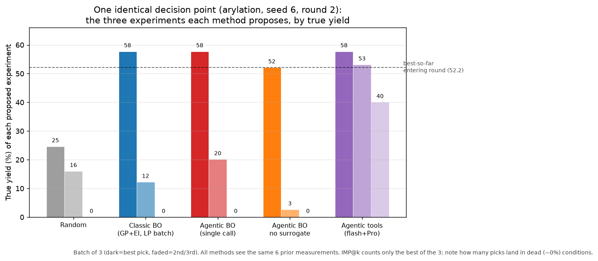
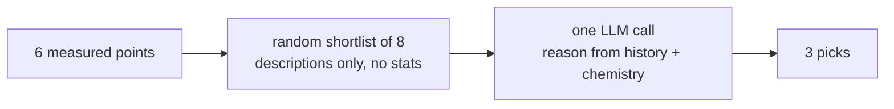
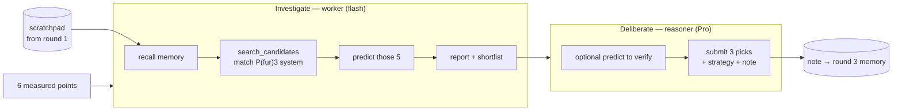

# Study 1's methods, side by side — one identical decision point

This document belongs to the agentic-BO study ([AGENTIC_BO.md](AGENTIC_BO.md)) and walks
**every one of its policies through the exact same decision** so the mechanisms are
directly comparable. It complements the results there (the *what*) with the *how*: what
each method sees, what it computes, and what it proposes — on one shared scenario, with
real numbers pulled from the code.

> **An illustration, not a benchmark.** It is a *single* round on a *single* seed.
> Conclusions about which method is better come from the 10-seed tables in
> [AGENTIC_BO.md](AGENTIC_BO.md); this document only makes the machinery concrete. The
> scenario was chosen because it is representative and the differences are legible.

## The shared scenario

Dataset: **direct arylation** (Shields 2021) — 1,728 candidate reaction conditions
(12 ligands × 4 bases × 4 solvents × 3 concentrations × 3 temperatures), a *deceptive*
landscape where ~32% of conditions give ~0% yield. The task: from a finite pool, find the
highest-yielding condition in as few experiments as possible. The state is frozen at
**round 2** (batch size q = 3, 10 rounds total), after 6 conditions have been measured:

| id | condition | yield |
| --- | --- | --- |
| 1470 | P(fur)3 / KOPiv / BuCN, 0.153 M, 90 °C | **52.2** |
| 990 | P(fur)3 / KOPiv / BuCN, 0.1 M, 105 °C | 47.0 |
| 1182 | P(fur)3 / KOPiv / BuCN, 0.057 M, 90 °C | 37.9 |
| 894 | P(fur)3 / KOPiv / BuCN, 0.1 M, 90 °C | 26.9 |
| 768 | BrettPhos / KOAc / DMAc, 0.153 M, 120 °C | 6.0 |
| 929 | PPhMe2 / CsOAc / BuOAc, 0.1 M, 90 °C | 0.0 |

Best-so-far entering the round: **52.2%**. Every method below is asked for **3 next
experiments** from this identical starting point. (The `agentic_tools` agent additionally
carries a memory note it wrote in round 1 — see its section.)

Three of the methods share a **surrogate view**: a Gaussian process is fit to the 6 points
and scored on all 1,722 unmeasured candidates. Its top candidates by Expected Improvement
(EI) are:

| id | pred ± std | EI | condition |
| --- | --- | --- | --- |
| 1566 | 41.3 | 2.251 | P(fur)3 / KOPiv / BuCN, 0.153 M, **105 °C** |
| 1662 | 38.7 | 2.234 | P(fur)3 / KOPiv / BuCN, 0.153 M, 120 °C |
| 1086 | 38.1 | 1.891 | P(fur)3 / KOPiv / BuCN, 0.1 M, 120 °C |
| 1374 | 36.0 | 1.659 | P(fur)3 / KOPiv / BuCN, 0.057 M, 120 °C |
| 703 | 31.9 | 1.571 | PPhtBu2 / KOPiv / BuCN, 0.153 M, 105 °C |

The GP has correctly learned that P(fur)3/KOPiv/BuCN is the promising region and that higher
temperature (unexplored) is where the improvement likely is. Note it *under*-predicts
(pred ~41 for the true 57.7) because one-hot features give it little to extrapolate from —
this matters below.

## Outcome at a glance



Each method's three picks and their true yields on this scenario:

| method | information it uses | how it chooses the batch | picks → true yields | batch best (IMP) | batch mean |
| --- | --- | --- | --- | --- | --- |
| **Random** | nothing | 3 uniform-random unmeasured points | 25, 16, 0 | 24.6 | 13.5 |
| **Classic BO** | GP mean/std/EI | argmax EI, then **local penalization** to spread the batch | 58, 12, 0 | **57.7** | 23.3 |
| **Agentic BO** (single call) | GP shortlist (8) + history, as text | one LLM call ranks the shortlist | 58, 20, 0 | **57.7** | 25.9 |
| **Agentic BO, no surrogate** | random shortlist (8) + history, **no stats** | one LLM call, chemistry only | 52, 3, 0 | 52.1 | 18.2 |
| **Agentic tools** (flash+Pro) | tools over GP + **whole pool** + memory | two-phase tool loop (investigate → deliberate) | 58, 53, 40 | **57.7** | **50.3** |

The headline: **four methods tie on IMP (57.7) or come close, but the batch quality is
completely different.** On this deceptive landscape, classic BO and both single-call agents
spend 2 of their 3 experiments on picks that land in ~0% conditions; the tool agent spends
all three productively. IMP@k (per-round *best* pick) hides this; batch mean exposes it.
This is why the tool agent wins cold-start/mid in [AGENTIC_BO.md](AGENTIC_BO.md) (lesson 8)
while the *final* metric — which rewards not wasting the budget — separates them less.

---

## 1. Random search — the floor

**Mechanism.** Pick 3 distinct unmeasured candidates uniformly at random. No model, no
history, no reasoning.

**On this scenario.** Drew ids 765, 892, 928 → yields **0.0, 16.0, 24.6**. It never
revisits the promising P(fur)3 region except by luck; best pick 24.6 is *below* the 52.2
already in hand, so the round makes no progress. Its only role is to calibrate how much the
other methods' structure is worth.

---

## 2. Classic BO — GP + Expected Improvement, local-penalization batch

**Mechanism.** Fit the GP, compute EI for every unmeasured candidate, take the argmax. For a
*batch* of q > 1, after each pick it **penalizes the acquisition of nearby candidates** (a
stand-in for qLogEI) so the batch spreads out instead of picking q near-duplicates — the fair
batch baseline from [AGENTIC_BO.md](AGENTIC_BO.md).

**On this scenario.** Pick 1 is the EI argmax, id 1566 (57.7 — the right call). But local
penalization then suppresses everything near 1566 — i.e. the entire P(fur)3/KOPiv/BuCN
cluster, which is *all* of the top-EI list — forcing picks 2 and 3 far away: id 571
(PPhtBu2 / CsOPiv / p-Xylene → **0.0**) and id 296 (tBPh-CPhos / KOPiv / DMAc → **12.2**).

> **The mechanism on display:** enforced batch diversity is exactly right on a smooth
> landscape and exactly wrong on a deceptive one — it pushes 2/3 of the budget out of the one
> good region into dead conditions. The agent methods, which reason about *where* the dead
> zones are, don't have to.


---

## 3. Agentic BO — single LLM call over a surrogate-informed shortlist

**Mechanism.** The harness fits the GP and builds a **shortlist of 8**: the 6 highest-EI
candidates plus the 2 highest-*uncertainty* ones (so exploration is always available). It
hands the LLM the measured history and this shortlist — each candidate as chemistry text with
`pred ± std` and `EI` — in **one call**, and the model returns a ranked pick set plus a
`strategy` and `rationale`. The LLM never queries anything; it ranks what it is given.

**The shortlist it was handed** (note picks 7–8 are the high-uncertainty explorers):

| id | pred ± std | EI | condition |
| --- | --- | --- | --- |
| 1566 | 41.3 ± 15.6 | 2.251 | P(fur)3 / KOPiv / BuCN, 0.153 M, 105 °C |
| 1662 | 38.7 ± 17.6 | 2.234 | P(fur)3 / KOPiv / BuCN, 0.153 M, 120 °C |
| 1086 | 38.1 ± 16.9 | 1.891 | P(fur)3 / KOPiv / BuCN, 0.1 M, 120 °C |
| 1374 | 36.0 ± 17.4 | 1.659 | P(fur)3 / KOPiv / BuCN, 0.057 M, 120 °C |
| 703 | 31.9 ± 19.8 | 1.571 | PPhtBu2 / KOPiv / BuCN, 0.153 M, 105 °C |
| 707 | 31.9 ± 19.8 | 1.571 | X-Phos / KOPiv / BuCN, 0.153 M, 105 °C |
| 572 | 26.7 ± 20.7 | 1.085 | tBPh-CPhos / CsOPiv / p-Xylene, 0.057 M, 120 °C |
| 1436 | 26.7 ± 20.7 | 1.085 | GorlosPhos / CsOPiv / p-Xylene, 0.057 M, 120 °C |

**On this scenario.** `strategy = balance`; picks **1566, 703, 572** → **57.7, 0.0, 20.1**.
> rationale: *"Exploit the most promising region with the highest EI, while also exploring new
> ligands and conditions with high uncertainty to discover potentially higher optima."*

It took the EI winner (1566) then, true to "balance", took two higher-uncertainty
shortlist items (a different ligand, and a p-Xylene explorer) — both of which are dead. Same
failure mode as classic BO's LP batch: the exploration slots land in ~0% conditions. It ties
on IMP (57.7) but its batch is weak (mean 25.9).


---

## 4. Agentic BO, no surrogate — single LLM call, chemistry only (ablation)

**Mechanism.** Same single call, but the shortlist is a **random** sample of 8 unmeasured
candidates presented as **descriptions only** — no GP mean/std/EI. This isolates what the
model's own chemistry knowledge contributes, with the surrogate removed.

**The random shortlist it was handed** (no surrogate numbers):

```
763  PPhtBu2 / CsOPiv / p-Xylene, 0.153 M, 105 C      644  tBPh-CPhos / CsOPiv / BuOAc, 0.153 M, 90 C
1632 P(fur)3 / KOAc / DMAc, 0.153 M, 120 C            925  PPh2Me / CsOAc / BuOAc, 0.1 M, 90 C
889  PPh2Me / KOAc / BuCN, 0.1 M, 90 C                1135 PPh2Me / KOPiv / p-Xylene, 0.1 M, 120 C
634  PPh3 / KOPiv / BuOAc, 0.153 M, 90 C              589  PPhtBu2 / CsOAc / DMAc, 0.153 M, 90 C
```

**On this scenario.** `strategy = balance`; picks **1632, 889, 634** → **52.1, 0.0, 2.6**.
> rationale: *"Prioritize testing the best performing individual components (ligand, base,
> solvent) in new combinations to confirm their efficacy and discover new high-performing
> conditions."*

With no surrogate scores, the model read the *measured history*, inferred that **P(fur)3** is
the key ligand, and picked the one P(fur)3 candidate in the random list (1632 → 52.1) even
though it pairs P(fur)3 with a different base/solvent (KOAc/DMAc). That is chemistry-style
reasoning the GP-over-one-hots cannot do at this budget — but without the surrogate to point
at the *right* temperature variations, it cannot match the tool agent's batch. IMP 52.1.



---

## 5. Agentic tools — the genuinely-agentic loop (two phases, two models)

**Mechanism.** The model *drives* the round through tools, in two phases that use different
models ([agentic.py](../src/agentic_bo/agentic.py)). It carries a **scratchpad** across rounds.

- **Investigate** (worker = gemini-2.5-flash): a tool loop. `recall` its notes, `predict` the
  surrogate on any candidates it names, `search_candidates` across the whole pool by
  EI/mean/uncertainty/**reagent match**/random — not a fixed shortlist. Ends with `report`.
- **Deliberate** (reasoner = gemini-2.5-pro): given the report + history + memory, optionally
  `predict` to verify, then `submit` the batch with a note for next round.

**On this scenario** (memory carried in from round 1: *"The P(fur)3/KOPiv/BuCN system is the
only one showing high yield so far. This round focuses on optimizing temperature and
concentration…"*). The worker ran **4 tool calls**:

1. `recall()` → gets the round-1 note above.
2. `search_candidates(mode="match", match="ligand=P(fur)3, base=KOPiv, solvent=BuCN")` →
   finds the 5 unmeasured conditions in that exact system.
3. `predict([1086, 1278, 1374, 1566, 1662])` → surrogate scores for those 5.
4. `report(findings="…higher temperatures at 0.153 M and 0.1 M/120 C have the highest EI",
   shortlist=[1566, 1662, 1086])`.

The reasoner (Pro) then `submit`ed **1566, 1662, 1086** → **57.7, 53.1, 40.0**:
> strategy: `exploit` · rationale: *"All top candidates are in the promising P(fur)3/KOPiv/BuCN
> system; this batch explores the effect of higher temperatures at promising concentrations."*
> note (→ memory for round 3): *"Continuing to exploit … by exploring higher temperatures. If
> these show a positive temperature correlation, explore higher still…"*

Because it **searched within the known-good system itself** instead of taking a
diversity-forced or high-uncertainty shortlist, all three picks are productive (batch mean
**50.3** vs ≤26 for the others). It confirmed the temperature hypothesis: 90 °C → 105 °C
lifted best-so-far 52.2 → **57.7**.



The agent used its agency economically (~3 tool calls this round) and, when asked what it
*would* do with loop control, kept the batch at 3 and did not want to stop — so holding q
fixed for a fair comparison cost nothing here.

---

## What is "the agent" vs. the harness

In every LLM method the split is the same and worth stating plainly:

- **The harness** always fits the GP, computes EI, executes tools, and measures the true
  yield. The model **never sees a yield before choosing.**
- **The single-call agent** (methods 3–4) only *ranks* a shortlist the harness built.
- **The tool agent** (method 5) additionally decides *what to look at* — which candidates to
  score, how to search the pool, what to remember — which is the qualitative jump from
  "LLM-guided BO" to an agent, and where the cold-start gain in [AGENTIC_BO.md](AGENTIC_BO.md) comes from.

## Reproduce

The traces above are regenerated from the decision cache (free, deterministic). One full
turn-by-turn iteration for the tool agent, and every method on a fixed state, are produced by
the same policies exercised in `run_agentic_bo.py`; see [AGENTIC_BO.md](AGENTIC_BO.md) for the
10-seed results these single-round illustrations are drawn from.
