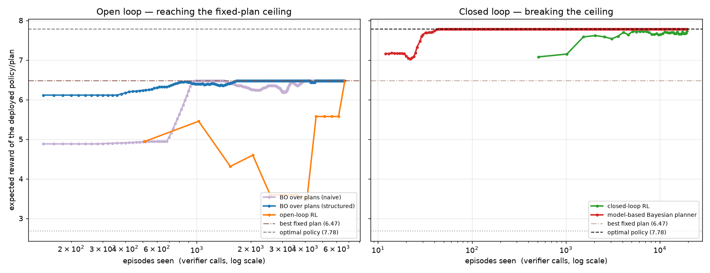
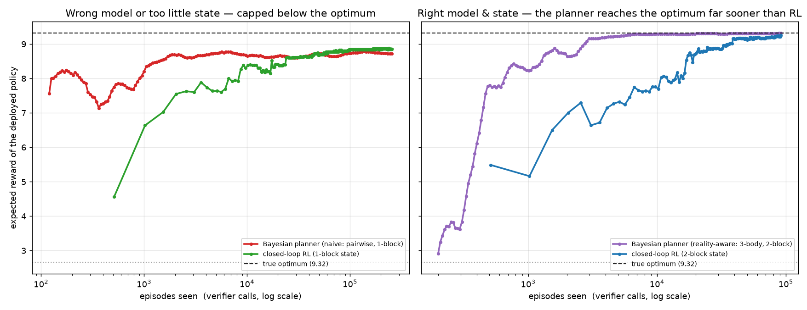

# Sequential design: reinforcement learning vs. Bayesian optimisation

This example designs a molecular linker one building block at a time and compares
reinforcement learning against Bayesian optimisation on the exact same task. It is the
other regime from the pool-based BO study in this repo. There, the task was to *select*
the next experiment from a fixed pool — a bandit, the setting BO fits. Here it is to
*construct* a candidate through a sequence of decisions under uncertainty — a Markov
decision process, the setting RL is built for.

**One setup, two realism knobs.** There is a single task (`rl_design/design.py`) and a
single set of methods (`rl_design/methods.py`). Two knobs turn the idealised task into
a realistic one:

* `--triplet-strength` adds a **3-body reward** term a pairwise model cannot represent.
* `--obs-noise` adds **measurement noise** to the verifier.

```bash
uv run run_rl_design.py                 # idealised (knobs off)
uv run run_rl_design.py --realism       # realistic  (noise + 3-body reality)
```

Both settings are analysed below. The idealised one establishes the core result — the
open-vs-closed-loop ceiling, and where BO fits; the realistic one is the reality check
that shows what survives when the model can be wrong.

> **A caveat on the numbers.** The task is designed, so the specific numbers — episode
> counts, percentages, the "500×" / "16×" ratios — follow from the design choices and would
> move with them. What generalises is the qualitative structure: *which* methods hit a
> ceiling, *why* (open loop, wrong model, too little state), and the direction of each
> trade-off. The reference values (best fixed plan, optimal policy) are the one exact thing:
> they come from dynamic programming, not training.

## Terminology

* **Episode (rollout)** — one complete attempt: build a full chain, receive one
  score at the end.
* **Verifier / reward** — the scorer of a finished chain; the number to maximise.
* **Policy** — the rule that picks which block to install at each position.
* **Open loop** — a plan fixed in advance and executed regardless of what happens.
* **Closed loop** — each choice reacts to what has actually been built so far.
* **Context** — how many previously *realised* blocks a policy looks at
  (0 = open loop, 1 or 2 = closed loop).
* **Model-based** — learn a model of the reward from data, then plan the best
  policy against that model.
* **Model-free** — learn behaviour directly from trial and error, with no model
  of the task anywhere.
* **Dynamic programming (DP)** — exact computation of the best possible policy
  and its value; used as the 100% reference line, not as a competitor.
* **% of optimum** — a method's expected result as a fraction of that exact
  optimum.

## The task

An episode assembles a chain of `length` building blocks (default 6) from a small
vocabulary: `Ph`, `Py`, `COOH`, `NH2`, `OH`, and a `spacer`. The blocks fall into donor
(`NH2`, `OH`) and acceptor (`COOH`, `Py`) groups.

* **State** — the step index and the last *realised* blocks (how many is a policy's
  *context*, below).
* **Action** — the block to install next.
* **Transition** — a coupling succeeds with probability `success_prob` (default 0.6)
  and installs the chosen block; otherwise it mis-couples and a uniformly random block
  ends up in that position.
* **Reward** — paid once, at the end, by a verifier scoring the realised chain: a
  per-block term, an adjacency term that rewards complementary donor/acceptor pairs
  (+2), penalises like-next-to-like (−1), and rewards aromatic stacking; plus, under
  `--realism`, a 3-body term and observation noise.

Two properties make this reinforcement learning rather than optimisation over
independent choices. **Sequential:** the reward couples neighbouring positions, so the
best block to add depends on what precedes it. **Stochastic:** because couplings fail at
random, the realised chain diverges from any fixed plan, so the best next action depends
on what was *actually* installed.

**Context.** A policy conditions on the last `c` realised blocks: `c = 0` is *open loop*
(a fixed plan that ignores what happened), `c = 1` conditions on the last block, `c = 2`
on the last two (enough for the 3-body reward). Because the vocabulary and length are
small, the exact expected value of any deterministic policy — and the optimum at each
context — is computed by backward dynamic programming over the last two blocks. That
gives an exact "% of optimum" scale with no training, and it is validated against Monte
Carlo in the tests.

## The methods (one roster)

**How to read the x-axis.** Every method starts from scratch — no pre-collected data. One
**episode** is one rollout of a full linker, scored once by the verifier, so episode counts
are directly comparable across methods. What differs is what one episode *buys* each method:

* **REINFORCE policy** (`Policy`) — the only **model-free** method: a from-scratch
  tabular-softmax policy gradient on the true reward, with no model of the task anywhere.
  Its context `c` sets what it sees: `c = 0` is open loop (a plan that ignores outcomes),
  `c = 1`/`2` are closed loop (react to the last one/two realised blocks). **One episode
  buys one noisy gradient nudge** — which is why it needs thousands.

* **Model-based Bayesian planner** (`model_based_planner`) — learns a **reward model**
  online from its own rollouts; it gets no data in advance. Each episode it tries one random
  plan, refits a Bayesian linear regression on the chain's count features, and re-plans the
  optimal policy by DP under that learned reward. So "reaches the optimum in ~40 episodes"
  means: ~40 self-collected rollouts, start to finish, no head start (the first ~12 are
  warm-up; ~120–200 under noise). **One episode buys a full labelled example** for a model
  with a few dozen parameters — which is why it needs so few. Two honest notes: the
  transition model (the coupling failure rate) is *given*, only the reward is learned; and
  `--realism` is designed to break exactly this advantage, by making a pairwise reward
  model misspecified.

* **BO over plans** (`bo_on_plans`) — classic Bayesian optimisation over the pool of all
  6⁶ = 46,656 fixed plans, i.e. an *open-loop* optimiser, with either a generic GP or a
  structure-aware Bayesian-linear surrogate. **One evaluation is one plan averaged over
  `replicates` rollouts** (a single rollout is too noisy to rank plans); the x-axis counts
  every rollout.

Backward DP provides exact reference lines: the **optimal policy** (= 100%) in both plots,
plus the **best fixed plan** (the open-loop ceiling) on the idealised task. In the tables,
**"% of optimum"** is the plateau a method converges to and **"reaches it at"** the episode
it first gets there. A plateau below 100% is a real ceiling: the fixed-plan cap, a wrong
model, or too little state.

---

# Idealised task — `uv run run_rl_design.py`

Pairwise reward, no noise. Every method is scored on the same verifier and plotted
against episodes (verifier calls) consumed.



| method | % of optimum | reaches it at |
| --- | --- | --- |
| BO over plans (naive GP) | 74% | ~940 |
| BO over plans (structured) | 74% | ~800 |
| open-loop RL | 74% | ~6,700 |
| closed-loop RL | 99% | ~19,500 |
| model-based Bayesian planner | 100% | ~40 |
| *best fixed plan (exact)* | 74% | — |
| *optimal policy (exact)* | 100% | — |

The three open-loop methods all converge to the best fixed plan (74%) and stop there — the
structured BO surrogate gets to that ceiling fastest (~800 episodes), the naive GP a little
slower (~940), open-loop RL much slower (~6,700). The two closed-loop methods pass the ceiling
and reach the optimum — the model-based planner ~500× sooner than model-free RL.

### Left panel — open loop is capped at the fixed-plan ceiling (74%)

The three open-loop methods all plateau at the brown line, the best fixed plan:

* **BO over plans** searches the 46,656 fixed plans with GP + Expected Improvement and
  reaches the ceiling in under a thousand episodes — BO doing what it is good at:
  sample-efficient search for the best *fixed* input. The structured surrogate gets there
  a little faster and far more reliably across seeds than the naive GP; the lesson is that
  BO is strengthened by putting the problem's structure into the model, not by a fancier
  kernel.
* **Open-loop RL** (context 0) reaches the same ceiling ~7× slower (~6,700 episodes) — it
  is optimising a fixed plan too, just less efficiently.

None of them can pass 74%, however advanced, because a fixed plan cannot react to a
random mis-coupling. The ceiling is a property of the open-loop *candidate class*, not of
the optimiser.

### Right panel — closing the loop crosses the ceiling (toward 100%)

* **Closed-loop RL** (context 1) reacts to the realised previous block and repairs
  mis-couplings as they happen. It reaches 99% of the optimum — but model-free learning
  pays for it: ~19,500 episodes, most of them spent on the last few percent.
* **The model-based Bayesian planner** reaches the optimum in about **40 episodes** —
  ~500× fewer. The idealised reward is additive, so its linear reward model is exact after
  a few rollouts, and DP does the rest. Closed loop, so not capped at 74%; model-based, so
  dramatically cheap.

### What the idealised result says

Two independent axes, not one:

* **Open vs. closed loop** sets the *ceiling*. Only reacting to the realised state passes
  74%, and both an RL policy and a Bayesian planner can do it.
* **Model-based vs. model-free** sets the *sample cost*. A model-based method reaches the
  optimum ~500× faster than model-free policy gradient here.

So "BO vs. RL" is not the real question — there is closed-loop BO (the planner) and
open-loop RL. The real questions are *open vs. closed loop* and *model-based vs.
model-free*.

---

# Realistic task — `uv run run_rl_design.py --realism`

The planner's 40-episode optimum rests on two idealisations: a perfectly specified reward
and noise-free scores. `--realism` takes both away:

* the reward gains a **3-body term** a pairwise model cannot represent — reaching the optimum
  now takes a 3-body model (for a planner) and a 2-block state (for any policy);
* the verifier gains **strong measurement noise** (`obs_noise 3.0`, comparable to the reward
  span itself).

The two "planners" below are the *same* Bayesian planner as above, differing only in the
model order and state they use — the labels say which. Every curve runs until it is
demonstrably flat, so a plateau below 100% is a real limit, not a budget artifact.



| method | model | state | % of optimum | reaches it at |
| --- | --- | --- | --- | --- |
| Bayesian planner (naive) | pairwise | 1 block | 91% | ~1,800 |
| closed-loop RL | model-free | 1 block | 93% | ~72,700 |
| Bayesian planner (reality-aware) | 3-body | 2 blocks | 100% | ~5,700 |
| closed-loop RL | model-free | 2 blocks | 99% | ~91,600 |
| *true optimum (exact)* | — | 2 blocks | 100% | — |

The headline: **noise slows a method down; only a wrong model or missing state caps it.** The
right-model planner still reaches the optimum — noise costs it ~140× the idealised episode
count (5,700 vs. 40), but not the destination — and it still gets there **~16×** sooner than
model-free RL. What noise does *not* do is rescue a misspecified model: the pairwise planner
is capped at 91% forever.

### Left panel — a wrong model or too little state caps a method below the optimum

* **The naive Bayesian planner** (pairwise model, 1-block state) climbs fast, flattens at
  **91%** by ~1,800 episodes, and stays there for the remaining ~254,000. That is **model
  bias**: the pairwise fit captures the *average* effect of the 3-body term (which is why it
  gets as high as 91%), but no amount of data recovers what its model cannot represent.
* **Model-free RL with a 1-block state** has no model to be wrong, and edges past the planner
  to **93%** — but its state cannot see two blocks back, which the 3-body term needs, so it
  flattens short of the optimum too. Its limit is **too little state**, and being model-free
  it pays ~72,700 episodes (~40× the planner) for those two extra points.

### Right panel — the right model & state reach the optimum; the model buys ~16×

* **The reality-aware Bayesian planner** (3-body model, 2-block state) reaches the optimum
  (**100%**) in ~5,700 episodes. Noise makes convergence erratic and ~140× longer than the
  idealised 40 — with noise comparable to the signal, one observation says little, and
  pinning down 6³ = 216 triplet weights takes thousands — but it gets there. Noise is a
  *slowdown*, not a *cap*.
* **Model-free RL with a 2-block state** also reaches the optimum (**99%**), with no reward
  model at all — at ~91,600 episodes, **~16×** the planner. (The idealised 500× gap shrinks
  to 16× because noise hurts the planner's regression more than it hurts REINFORCE, which
  already averages over batches.) When the model *can* be made right, the planner wins.

### What the realistic result says — the sim-to-real gap

Realism splits into two different failure modes with opposite remedies:

* **Noise is a slowdown.** A well-specified model still reaches the optimum, just slower
  (40 → ~5,700 episodes here). The remedy is patience or replicates — the method is fine.
* **Misspecification is a cap.** A pairwise model stops at 91% *no matter how many episodes it
  sees, and no matter how much state it gets*. More data sharpens its confidence in a wrong
  answer. The only remedies are fixing the model class — or going model-free.

That changes the model-based-vs-model-free question. It is *not* "fast but biased vs. slow
but exact": with the right model class, model-based planning is both ~16× faster *and* just
as exact. Model-free RL's real niche is when the model class **cannot be fixed** — it
reached 99% with no reward model at all, where every pairwise-model method was capped. The
practical order follows: spend effort on the model class first (here it cost one extra
feature order); go model-free where the model stays wrong; and keep real evaluations coming
in, because a capped model and a converged one look identical from inside — a flat curve
and a confident model.

---

# When is RL the right tool? (and the hybrid in practice)

The two experiments give a decision rule, and it rarely lands on *pure model-free RL*. (The
multipliers below are illustrative of a designed task — see the caveat above; it is the
*direction* of each trade-off, not the exact factor, that generalises.)

**Model-free RL is usually the wrong first choice.**

* **Not a sequential decision?** Choosing a fixed design, or the next experiment from a
  pool, is a bandit — use **BO / active learning**. Forcing RL onto it adds cost without
  raising any ceiling: open-loop RL is capped at the same best fixed plan (74%) as every
  other fixed-design optimiser.
* **Sequential, but a trustworthy model can be built?** Use **model-based planning** — learn
  the model, plan, replan. It reached the same optimum as model-free RL for ~500× fewer
  episodes on the clean task, and still ~16× fewer under heavy noise.

**Model-free RL earns its cost only when three conditions line up:**

1. **The decision is genuinely closed-loop** — step outcomes are uncertain and the next
   choice must react to them. Only closing the loop passes the fixed-plan ceiling.
2. **The model class cannot be made right**, so a planner is *capped*, not merely slow. That
   is the realistic result: the pairwise planner stays at 91% however many episodes (and
   however much state) it gets, while model-free RL reaches 99% with no model at all. The
   asymmetry matters: where the model *could* be fixed, fixing it beat switching to RL
   by ~16×.
3. **A cheap, faithful verifier exists.** Model-free RL needed ~91,600 episodes here. That
   is affordable against a simulator; it is out of reach if every episode is a lab
   experiment.

**The practical answer is a hybrid, not a single method.** None of the methods here deploys
as-is — the exact planner needs a tiny state space, a known transition model and a
hand-designed feature basis, none of which reality provides. But each has a direct real-world
counterpart, and the division of labour is simple:

* **Picking the next expensive experiment → BO / active learning.** One decision at a time,
  chosen so each measurement improves the model as much as possible. This is everyday
  Bayesian optimisation (a surrogate plus one-step lookahead), and it is where the scarce
  *real* measurements should be spent.
* **Making the sequential decisions → the model-based planner.** In real life this is Model
  Predictive Control: learn a model, plan against it, act, replan. When the model class fits
  reality it is both the fastest route to the optimum *and* just as exact (~16× fewer
  episodes than model-free RL under noise here, ~500× without).
* **When the model cannot be made right → model-free RL.** It needs no model, so it is immune
  to the 91% cap that stopped the misspecified planner — but only worth it against a cheap
  verifier or simulator: its ~91,600-episode cost is out of reach if every episode is a lab
  experiment.

Plus two safeguards the toy motivates but does not implement:

* **Plan with the model's uncertainty, not just its best guess.** The planner here uses only
  the posterior mean, which under noise exploits weights the data has not pinned down;
  practical methods act conservatively where the model admits it does not know.
* **Keep real measurements coming in.** From inside, a capped model (the naive planner, 91%)
  looks exactly like a converged one (the reality-aware planner, 100%) — a flat curve and a
  confident model. Only fresh ground truth tells them apart.

In one line: *first decide whether the problem needs closed-loop control at all; then use a
model wherever one can be trusted, and pay model-free RL's sample cost only where it cannot.*

---

## Run it

```bash
uv run run_rl_design.py                 # idealised: RL vs. BO, five methods, two panels
uv run run_rl_design.py --realism       # realistic: noise + 3-body, the sim-to-real gap
uv run run_rl_design.py --realism --triplet-strength 1.5 --obs-noise 1.0   # harder reality
uv run pytest tests/rl_design/ -q
```

Outputs land in `results/rl_design/`: `rl_design_learning_curve.png` (idealised) or
`rl_design_realism_curve.png` (realistic), plus a `*_summary.json`. Everything is offline
and deterministic per seed (seed 0 traps the open-loop policy in a local optimum, so the
runner defaults to seed 1; the exact reference values are seed-independent).
